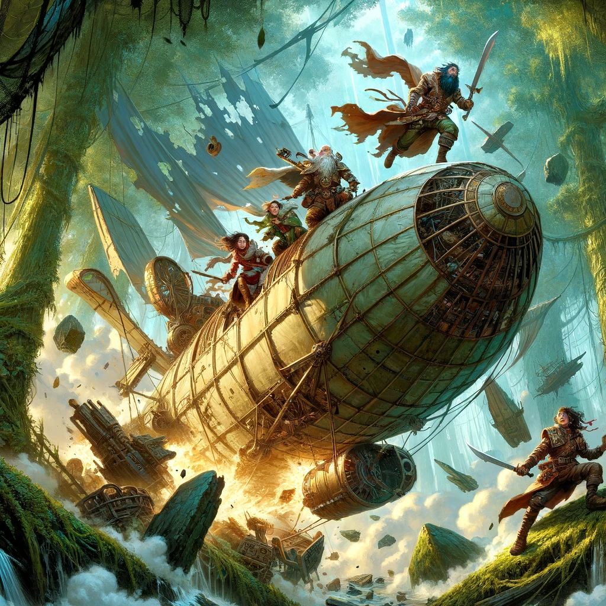
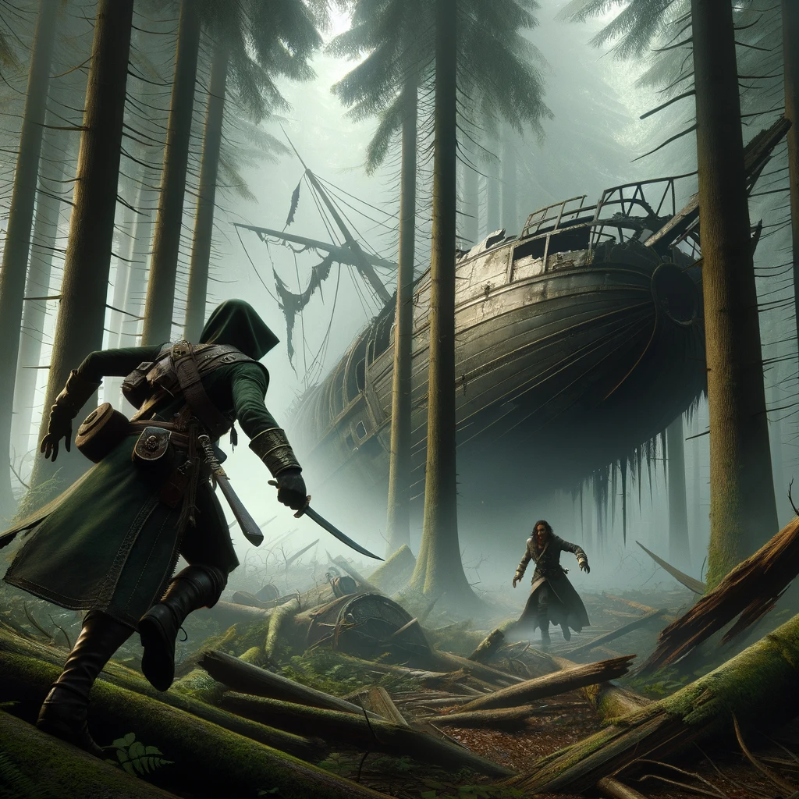

See [original notes](./chapter1-originalnotes.md) from the game session.

**Illustrations:** Dall-E

**Notes to text:** ChatGPT plus some human help

TODO:
* Work on the illustrations:
  * Make the ship look like the elemental airship from D&D.

# Chapter One: Shadows Over Shargon's Teeth

In the mystical world of Eberron, lay the vibrant city of Stormreach, a melting pot of adventure and intrigue. Here, in this bustling nexus, a group of unlikely heroes found their fates intertwined. Telmuir, the dwarf druid with a heart yearning for the mysteries of the surface world, had left the confines of his subterranean home to embrace the call of nature. His journey led him to cross paths with Sylvanus, an elf ranger, and Thuule, a human barbarian whose love for battle was matched only by his loyalty. Alongside them were Oliva, a disciplined human monk, and Rumata, a cunning halfling rogue, each with their own tale to tell. United by chance and bound by camaraderie, they were about to embark on an adventure that would test their courage and friendship.

Their tale began with an intriguing offer from Nivix, a gnome with a keen interest in soarwood, a rare and magical tree. While the group was initially drawn to the idea of charting the islands of Shargon's Teeth in search of this mystical wood, fate had other plans. Instead, they found themselves hired as guards on a flyship bound for Kuvair, a journey that would take them over the very islands they sought to explore.

The tranquility of their voyage was shattered by an audacious attack from a dark airship. Orcs and gnomes, an odd alliance of brute force and cunning, swarmed their vessel. In a surprising twist of the plot one of the passangers joined the attackers. In the ensuing chaos, the group displayed a remarkable blend of skill and tenacity. The battle culminated in a daring move when the always impulsive pair, Oliva and Telmuir (in a form of a brown bear), leaped onto the enemy ship in a quest to find information about their attackers and their motives. Sylvanus and Thuule, with a mixture of bewilderment and frustration, were left behind when the two ships separated and drifted further away from each other.

Aboard the rogue ship, Oliva and Telmuir, now back to his dwarven self, found themselves in a labyrinth of shadows and danger. Their search for clues in the darkness lead to discovery of the mage pilot who, crouched in the cockpit, was barely able to hold the ship in the air. Meanwhile, Sylvanus and Thuule faced their own predicament on the other ship, uncovering a betrayal that ran deep within the house of Lyrandar. The now deceased passanger that had been in the same conspiracy with attacking orcs had been member of the house, too.

Mage was not able to hold the ship in the air for long. The rogue ship's crash into Shargon's Teeth was as dramatic as it was perilous and ended up taking the life of the poor pilot. Amidst the splintering wood and chaos, Oliva and Telmuir, somewhat dazed but determined, began their search for answers. Concurrently, Rumata, who had been on his own secretive mission on the islands, was drawn to the site by the noise of the crash.

As dawn's light filtered through the trees, the fellowship, bruised and battered, reunited amidst the debris. Their joyous reunion, however, was cut short by the sudden appearance of Sahuagin, the fish-men inhabitants of the islands. The ensuing conversation, a mix of misunderstandings and cultural faux pas, eventually led to a shaky alliance against a group of pirates working on chopping down the sacred soarwood trees of the islands and leaving them bare.

The relative calm was shattered by the arrival of pirates, sparking a battle that was as chaotic as it was comical. Telmuir, in a strategic yet clumsy move, enveloped the area in a fog cloud, turning the skirmish into a blind dance of swings and misses.

The pirates, taken aback by this unexpected tactic, struggled to regain their footing. Sylvanus, with the aid of the Sahuagin, orchestrated a counterattack, his arrows finding their mark despite the chaos. Thuule, ever the warrior, engaged the pirates with ferocity, his sword a blur as he defended his comrades. A few mishaps and close calls left Sylvanus and Thuule incapacitated before being revived by the magic of their allies.

The battle raged on, with each member of the group showcasing their unique skills. Oliva's martial arts prowess was a sight to behold, as she deftly navigated the fog, her strikes precise and effective. Rumata, blending into the shadows, emerged at opportune moments to deliver critical blows.

Exhausted yet triumphant, the group caught their breath, the gravity of their situation setting in. They had stumbled upon a complex web of intrigue involving dragon-mark houses, piracy, and the enigmatic soarwood. With a pirate captive in tow and many questions looming, they prepared to delve deeper into the mysteries of Shargon's Teeth, their bond strengthened by the trials they had faced and the laughter they had shared.
