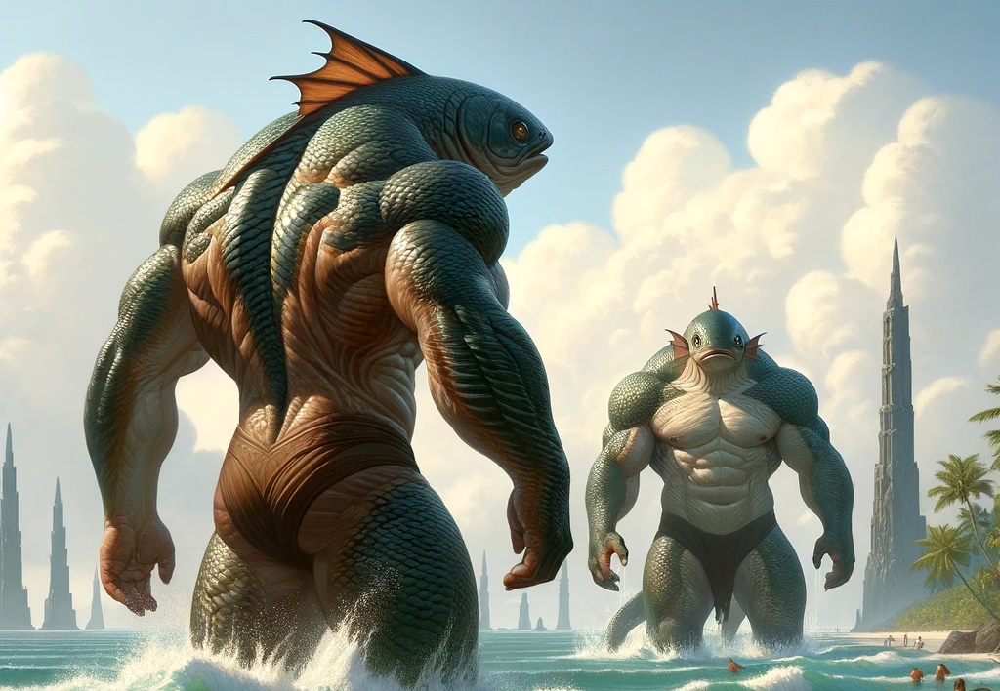
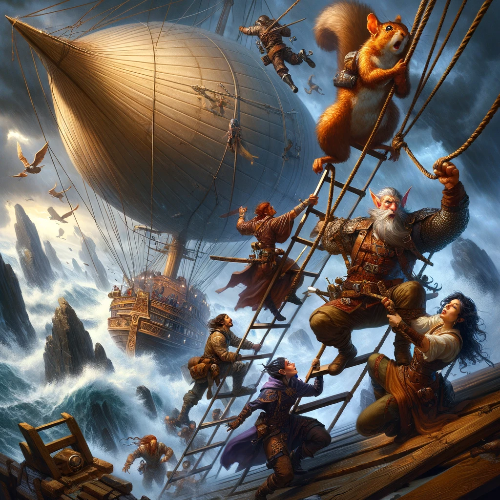

# Chapter Two: Spire Troubles and Fishy Affairs

In the mysterious and rather peculiar archipelago of Xendrik, where compasses go haywire and islands defy the laws of nature, our intrepid band of adventurers found themselves in quite the pickle. Midday sun beat down on them, casting long shadows from the towering spires made of what can only be described as 'demon glass'—not the sort of material you'd find at your local builder's merchant.

After their recent scuffle with pirates, which left them victorious but exhausted, the fellowship—Telmuir, Rumata, Sylvanus, Thule, and Oliva—were promised a ship. They weren't given a cruise liner, mind you, but rather the chance to hitch a ride on an airship, assuming they could survive long enough to catch it.

Our story continues with the captured pirate, a trembling mess before Thule's impressive barbarian scowl. The poor fellow was more scared of Thule's frown than a child is of the dark. "Should we kill him?" Sylvanus pondered, to which Thule responded with an attempt at intimidation that would've made a bear reconsider its choices. The pirate, practically in tears, was no fountain of information. His babbling only revealed a pirate lord named Utrack—bad news by all accounts, and apparently as friendly as a shark with a toothache.

Deciding to follow the fishmen led by a priest as inscrutable as a cat in a sunbeam, the adventurers trekked through the jungle, captivated and slightly unnerved by the towering spires. The journey was slow, hampered not just by the terrain but by the captive's incessant sobbing and the occasional slip in the mud, which was more comical than hazardous.

Upon reaching a beach, the fishmen vanished into the sea, leaving our heroes with a beach party's worth of demon glass spires, a captive pirate, and an increasingly curious Oliva. "Should we dive after them? How well do we swim?" she mused, ignoring the fact that armor and water don't mix well.

Deciding against a swim, they opted for a short rest, during which Telmuir suggested investigating the spires. Sylvanus, ever practical, wondered aloud if putting the pirate's head underwater might test the water's quality. The group quickly realized the pirate knew less about their plans than a squirrel knows about open-heart surgery.

After some rest and a questionable meal provided by the fishmen—whose culinary skills left much to be desired—the group was once again on the move. Their dreams that night were vivid and bizarre, filled with images of spires turning into giant chicken legs and pirates running a bakery.

The next morning, as they awaited their airship ride, a debate ensued about the best way to signal their location. Sylvanus's idea of shooting a flaming arrow into the sky was met with nods until Telmuir pointed out, "Why not use a big bonfire?"—a suggestion that was promptly ignored in favor of the more dramatic arrow approach.

Their escape from the island was as chaotic as their arrival. Oliva's attempt to climb the rope ladder with the grace of an acrobat ended with a tumble that would've made a circus clown proud. Sylvanus, meanwhile, managed to climb aboard only to be buffeted by a gust of wind that threatened to send him flying back down, a reminder that nature had a sense of humor too.

Back on the airship, they were greeted by Captain Lazea, who listened to their tale with a mixture of disbelief and amusement. "You fought off pirates, made friends with fishmen, and survived demon glass spires?" she asked, eyebrow raised. "All in a day's work," Telmuir responded with a grin, omitting the part where they nearly poisoned themselves and turned a simple signal fire into a spectacle.

As they set course for Trolanport, the group reflected on their adventures. They had braved the unknown, faced fearsome enemies, and, most importantly, managed to not drown each other during swimming lessons. Ahead of them lay new challenges, but for now, they enjoyed a moment of peace, laughter echoing on the wind as the airship sailed into the sunset, leaving behind the mysteries of Xendrik for the modern marvels of Zilargo.

And so, our adventurers' journey continued, a blend of courage, comedy, and the occasional culinary disaster, proving once and for all that in the world of Eberron, the greatest adventure is surviving your own teammates.
