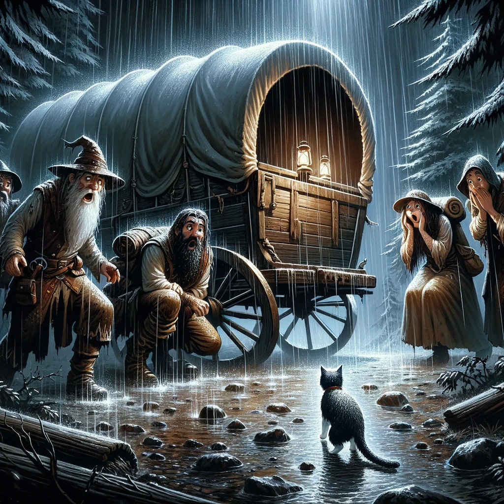

See [original notes](./chapter5-originalnotes.md) from the game session.

**Illustrations:** ChatGPT 4o

**Notes to text:** ChatGPT 4o plus some human help

# Chapter 5: Shadows of New Cyre (as recollected by Telmur)

The adventurers were once again scattered across the land. Fonzi, Sylvanus, Oliva, and Thule had their adventure playing out in Starilaskur, while Telmur had unintentionally strayed apart, the weight of exhaustion clouding his mind and leading him astray.

After the mysterious adventure and amazing victory of the magical carnival game in Starilaskur, Fonzi, ever the vigilant mage, sent his familiar, Bombom, to fetch Sylvanus from a nearby tavern. Sylvanus, still tipsy from the night’s revelries, found the rest of the group in a disheveled state, counting their winnings and packing their gold into bags. The mysterious entrance to the game they had encountered earlier had vanished, leaving them bewildered but richer.

On their way to find lodging, the group encountered an old woman selling dreamcatchers, claiming they could ward off nightmares. Intrigued, Oliva discreetly purchased a small one, fitting snugly in her palm. As the group settled into their inn for the night, Sylvanus retired to her room, while Oliva and Fonzi stayed behind, enjoying the company of bards who filled the air with song and laughter.

Later that night, as Fonzi observed the room, he noticed an old woman sitting in the corner, humming a lullaby from his childhood. She looked like an ordinary peasant woman, yet something about her struck a chord deep within him, reminding him of his mother. Approaching her, he discovered that she didn’t recognize him. Instead, she spoke wistfully of a group of bandits tormenting the locals in Siyar, hometown of Fonzi.

Meanwhile, Telmur, after a restless night and unable to find shelter, decided to rest where he was, though sleep offered little reprieve. Come morning, he resumed his journey, fortified by a handful of goodberries. As he ventured north, Telmur transformed into a horse, galloping towards what he believed to be safety. However, his transformation startled a passing caravan from House Vadalis. When he reverted to his dwarven form, the drivers were understandably terrified, but Telmur managed to calm them, eventually securing passage northwards towards New Cyre.

The main group, now somewhat refreshed, decided to first visit the bank before seeking out their, Sion, the person behind the mysterious game of magic. At the House Kundarak bank, the group faced various bureaucratic challenges. Fonzi, to his dismay, found that his personal account statement was missing. After much negotiation, the group established a shared account under the name “PORTS,” a name derived from their initials. They set a daily withdrawal limit of 500 gold pieces each, ensuring their funds were secure. Despite the tedious process, they left the bank with a sense of accomplishment, only to discover that Simon’s tent had disappeared. A neighboring alchemist laughed, assuring them that Simon would find them when the time was right.

Telmur’s journey was less straightforward. He learned from a Cyrelian traveler named Jake about the current state of New Cyre—a town filled with refugees, led by Prince Oargev, a ruler in exile. The town had seen its share of conflict, with craters surrounding it from battles fought during the war. Telmur’s heart ached with a strange sense of nostalgia as he approached the town, though it was a place he had never called home.

That evening, by sheer coincidence, the separated party members reconvened at a small wagon shelter. Telmur, arriving late, spotted the others already asleep and decided to wake Sylvanus with a playful shout. The reunion was joyful, though brief, as they celebrated and shared stories late into the night.

The next morning, the group received a message from House Lyrandar, urging them to report on their findings. After much deliberation, they sent a vague reply, promising to continue their investigation into the troubling rumors of Uthrak’s theft of dragonshards and suspicious activity in Sterngate.

Their journey to New Cyre resumed under heavy rain. The storm grew fierce, causing their horses to panic and bolt into the nearby forest. Telmur, ever attuned to nature, tried to calm the horses, who warned him of a “bad place” ahead. As they struggled to control the wagon, a cat appeared out of nowhere, completely dry despite the downpour. From the shadows of the forest, a creature emerged.

The battle was chaotic. Telmur, in his excitement, forgot to secure the horses as he conjured bears to fight the creature. The horses bolted, but Oliva managed to catch and tie them to the wagon. Fonzi, already wounded by the creature’s vicious attacks, was forced to retreat. He cast a blinding spell, giving Bombom the courage to join the fray. Despite their best efforts, the creature proved resilient, shrugging off attacks from Telmur’s conjured bears, Oliva’s staff, and Sylvanus’s arrows.

Suddenly, Sylvanus was lifted high into the air, seven meters above the ground, by some unseen force. The creature, now locked in combat with Telmur’s bears, turned its attention to Sylvanus. It wrapped her in a suffocating embrace, its grip tightening with each passing second. Oliva, from her precarious position in the air, hurled daggers at the creature, while Fonzi unleashed an eldritch blast.

The storm’s fury reached its peak as lightning struck their wagon, setting its roof ablaze. Amidst the chaos, the creature stopped, growling something in a language none of them understood. Before the group could react, the creature and Sylvanus vanished, leaving behind only a charred wagon and the echo of the storm.

The adventurers were left stunned, the rain pounding down on them as they stared at the empty space where Sylvanus had been. The battle was over, but the cost was high—Sylvanus was gone, spirited away to another dimension by the mysterious creature.

As the storm subsided, the group huddled together, their minds racing with questions. Where had Sylvanus been taken? And what kind of enemy had they just encountered? With their resolve hardening, they knew their journey to New Cyre would have to wait. First, they needed to find Sylvanus and bring her back, no matter the cost.
